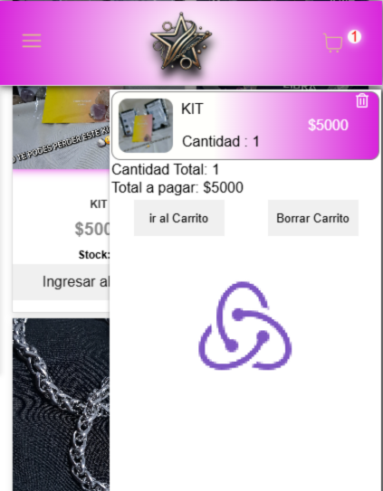
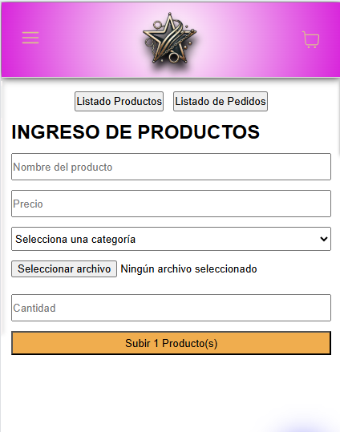
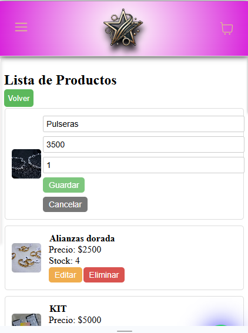
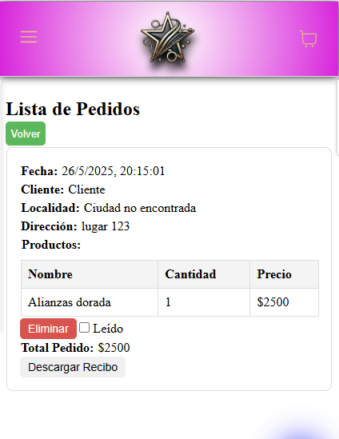

# 🎯 Proyecto: eCommerce Mobile-First | React + Supabase

Desarrollé una aplicación web de eCommerce optimizada exclusivamente para dispositivos móviles, utilizando **React**, **CSS** y **Supabase** como backend y base de datos.  
El proyecto incluye funcionalidades completas tanto para **usuarios** como para **administradores**.

---

## 🛒 Funcionalidades principales

### ✅ Carrito de compras interactivo
Permite a los usuarios agregar, ver y quitar productos de forma dinámica.

---

### 📦 Gestión de stock en tiempo real
El stock se actualiza automáticamente al confirmar un pedido o editar un producto desde el panel de admin.

---

### 🔧 Panel de administración

#### ➕ Crear, editar y eliminar productos  
#### 🖼️ Subir imágenes y actualizar precios o descripciones

---

### 📋 Sección de pedidos
Lista de pedidos detallada con opción de **descargar en PDF** para facilitar la administración.

---

## 📱 Experiencia fluida y adaptada 100% a dispositivos móviles

La interfaz fue diseñada con enfoque mobile-first para ofrecer una navegación intuitiva desde celulares.

---

## 💾 Datos gestionados en tiempo real 

  Supabase:
- Base de datos en tiempo real

  Cloudinary:
- Almacenamiento de imágenes

---

## 🧠 Lo que aprendí

Este proyecto me permitió consolidar mis habilidades en desarrollo **full-stack**, trabajar con bases de datos en tiempo real y crear una solución funcional y escalable para entornos **mobile-only**.

